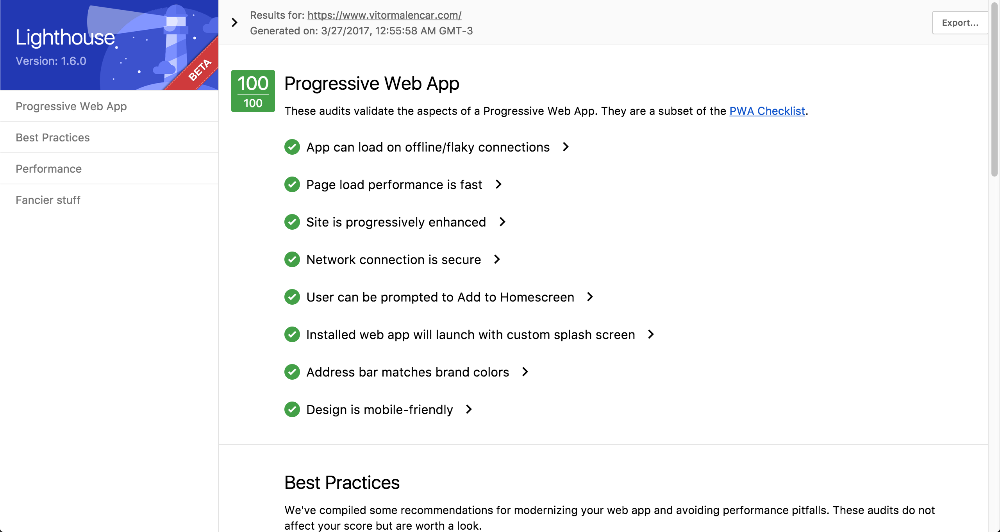

<p align="center">

  <a align="center" href="https://vitormalencar.com" target="_blank">
    </a>
  </a>
</p>

<h1 align="center">vitormalencar.com</h1>

<p align="center">My personal PWA :atom_symbol:</p>

<p align="center">
  <a href="https://travis-ci.org/vitormalencar/vitormalencar_pwa"></a>
  <a href="https://codeclimate.com/github/vitormalencar/vitormalencar_pwa"></a>
  <a href="https://snyk.io/test/github/vitormalencar/vitormalencar_pwa"></a>
  <a href=""></a>
</p>


## Summary

- 🔥 offline Ready
- 🎉 Small file size (4.9 minified + gzip)
- ⚡️ Blazing fast performance
- ⚛️ Build with [Preact](https:www.preactjs.com) :heart:
- 🔨 Compose with Components


## Features

* Offline Caching (via `serviceWorker`)
* SASS & Autoprefixer
* Asset Versioning (aka "cache-busting")
* ES2015 (ES6) and ES2016 (ES7) support
* Webpack Bundle Analysis (see [dashboard](#dashboard))
* Hot Module Replacement (HMR) for all files
* Preact's [Developer Tools](#preact-developer-tools)
* [Lighthouse](https://github.com/GoogleChrome/lighthouse) certified


  

## bundle sizes & perf
```
  app.js                  12.7 kB,  Gzipped size: 4.9 kB
  vendor.js               9.49 kB,  Gzipped size:  3.9 kb
```


## Development

### Commands

#### build

```
$ yarn build
```

Compiles all files. Output is sent to the `dist` directory.

#### start

```
$ yarn start
```

Runs your application (from the `dist` directory) in the browser.

#### dev

```
$ yarn dev
```

Like [`start`](#start), but will auto-compile & auto-reload the server after any file changes within the `src` directory.

#### Deploy to GH-PAGES

```
$ yarn deploy
```

MIT © [Vitor Alencar](https://vitormalencar.com)
